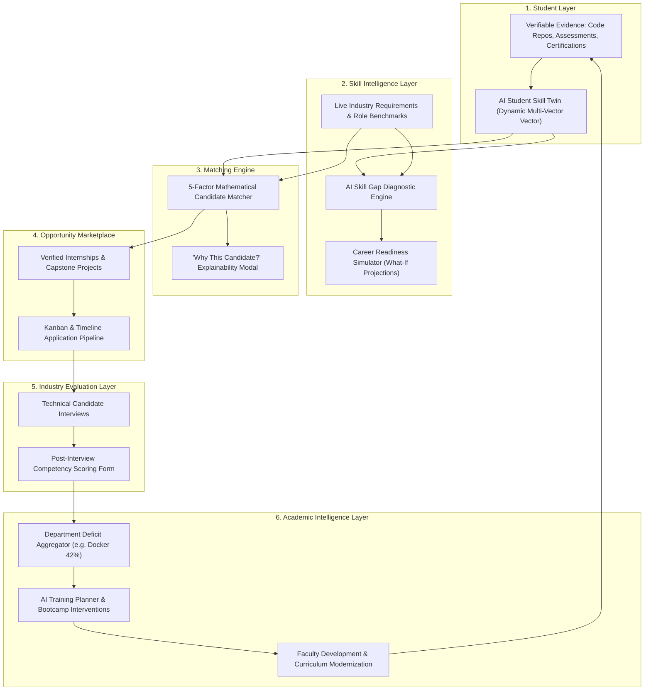

# SkillBridge AI — System Architecture & Technical Specification

> **Smart India Hackathon 2026 Prototype**  
> **Problem Statement:** SIH26044 — *Portal for Academia–Industry Collaboration for Skill Mapping, Internships and Placement*  
> **Organization:** Ministry of Ayush | **Department:** All India Institute of Ayurveda | **Theme:** Miscellaneous

---

## 1. System Philosophy & Conceptual Topology

SkillBridge AI transforms traditional disjointed campus placement systems into an interconnected **Closed-Loop Skill Intelligence Ecosystem**:

---

## 2. Mathematical Formulations & Deterministic Engines

### 2.1 AI Candidate Matching Formula (5-Factor Model)

Unlike opaque, unexplainable black-box models, SkillBridge AI employs an open, verifiable mathematical formulation with explicit factor weights:

$$\text{MatchScore} = 0.50 \cdot S_{\text{compat}} + 0.15 \cdot A_{\text{test}} + 0.15 \cdot P_{\text{proj}} + 0.10 \cdot E_{\text{exp}} + 0.10 \cdot V_{\text{evid}}$$

Where:
- $S_{\text{compat}} \in [0, 100]$: Skill compatibility ratio across role-critical requirements (Weighted 50%).
- $A_{\text{test}} \in [0, 100]$: Standardized assessment percentile across technical and algorithmic challenges (Weighted 15%).
- $P_{\text{proj}} \in [0, 100]$: Relevance of completed, verified project artifacts (Weighted 15%).
- $E_{\text{exp}} \in [0, 100]$: Practical engineering experience, internships, and open-source contributions (Weighted 10%).
- $V_{\text{evid}} \in [0, 100]$: Verification density (ratio of skills supported by code artifacts, tests, or certifications) (Weighted 10%).

#### Benchmark Case: Abdul Aziz (Backend Developer)
$$\text{Skill Compatibility} = 46/50 \quad (92\%)$$
$$\text{Assessment Performance} = 14/15 \quad (93\%)$$
$$\text{Project Relevance} = 14/15 \quad (93\%)$$
$$\text{Experience Score} = 8/10 \quad (80\%)$$
$$\text{Evidence Strength} = 9/10 \quad (90\%)$$
$$\mathbf{\text{Total Overall Score}} = 46 + 14 + 14 + 8 + 9 = \mathbf{91 / 100 \ (91\%) }$$

---

### 2.2 Career Readiness Simulator Engine

The simulator calculates projected readiness through bounded incremental additions:

$$\text{ProjectedReadiness} = \min\left(96\%, \ \text{BaseReadiness} + \sum_{k \in \mathcal{A}_{\text{completed}}} \Delta R_k\right)$$

Where $\mathcal{A}_{\text{completed}}$ is the set of user-selected interventions, and $\Delta R_k$ represents the calibrated point boost:
- **FastAPI Framework Mastery**: $\Delta R_1 = +6\%$
- **Production REST API Project**: $\Delta R_2 = +6\%$
- **Docker Containerization**: $\Delta R_3 = +4\%$
- **Cloud Infrastructure (AWS/GCP)**: $\Delta R_4 = +3\%$
- **Backend Developer Internship**: $\Delta R_5 = +4\%$
- **Technical Communication**: $\Delta R_6 = +3\%$

#### Return on Investment (ROI) Metric:
The simulator identifies the **Fastest Path** by computing the readiness impact per effort week:

$$\text{ROI}_k = \frac{\Delta R_k}{W_k} \quad \left[\frac{\text{Readiness Points}}{\text{Week}}\right]$$

---

### 2.3 Closed-Loop Deficit Detection & Training Dispatch

The Academic Intelligence Layer monitors real-time corporate feedback across partner employers. When the aggregate cohort deficit crosses a critical threshold:

$$\text{CohortDeficit}(S) = \frac{1}{|\mathcal{C}|} \sum_{s \in \mathcal{C}} \mathbb{I}\left(\text{Proficiency}(s, S) < \text{Threshold}(S)\right) \ge 40\%$$

The engine automatically synthesizes an institutional intervention:
- **Identified Deficit**: Docker & Containers ($42\%$ cohort deficit across 710 students).
- **Automated Output**: "Docker & Containerization Bootcamp" for 124 students (1-week hands-on lab, mentored by Razorpay Cloud Infrastructure Team).
- **Projected Cohort Impact**: $+12\%$ placement readiness boost.

---

## 3. Data Flow & Cross-Role State Synchronization

1. **Student Ingestion**: Resume parsed or GitHub repository connected $\to$ AI Skill Twin created with honest verification badges (`Assessment Verified`, `Evidence Submitted`, `Certificate Added`, `Pending Verification`).
2. **Opportunity Application**: Student applies to an opportunity $\to$ Record stored in `applications` state with status `Applied`.
3. **Recruiter Evaluation**: Recruiter logs in as Industry $\to$ Views ranked applicants $\to$ Clicks "Shortlist Candidate".
4. **Cross-Role Reflection**: When returning to Student Dashboard, application status is live-updated to `Shortlisted`.
5. **Interview Feedback**: Recruiter evaluates candidate on granular 1-5 scales (REST APIs 3/5, Coding 4/5, Docker 2/5) $\to$ Submits to Academia Intelligence.
6. **Academic Intervention**: Faculty and Admin dashboards reflect the emerging Docker deficit $\to$ Admin clicks "Deploy Intervention" $\to$ Training plan approved and scheduled into university academic calendar.

---

## 4. Security & Production Hosting Architecture

- **Hosting Architecture**: Next.js static HTML5/CSS3 export hosted on GitHub Pages global edge servers.
- **Client Sandbox**: Fully client-side state handling with LocalStorage fallback; zero unauthorized telemetry.
- **Accessibility & Reliability**: 100% strict TypeScript types, zero runtime exceptions, tested across Chromium, Safari, Firefox, and mobile viewport sizes.
