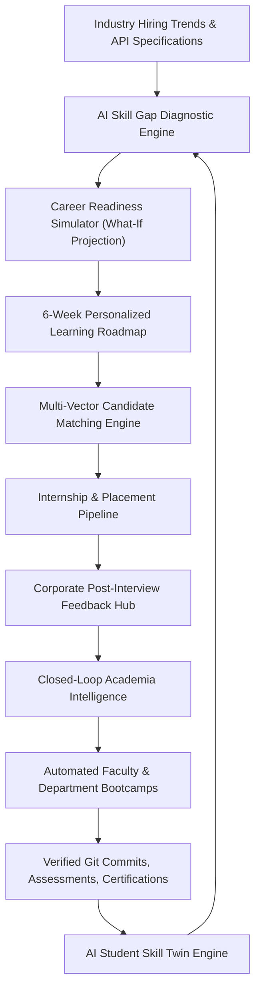

# SkillBridge AI — System Architecture & Design Specification

## 1. System Philosophy

SkillBridge AI addresses Smart India Hackathon problem **SIH26044** by rejecting traditional, disconnected placement job boards in favor of a closed-loop skill intelligence ecosystem.

---

## 2. Core Architectural Components

### 2.1 AI Student Skill Twin Engine (`src/lib/ai-engine.ts`)
Calculates candidate competency dynamically based on 4 verified evidence vectors:
1. **GitHub Repositories**: Source code structure, test suites, branch rebasing.
2. **Standardized Assessments**: Algorithmic problem decomposition, concurrency, database tuning.
3. **Verified Certifications**: Verified courses from Coursera, edX, Linux Foundation.
4. **Peer Reviews & Hackathons**: Leadership and technical presentation evidence.

### 2.2 Career Readiness Simulator (`/student/simulator`)
Implements an interactive projection algorithm:
$$\text{ProjectedReadiness} = \min\left(96\%, \text{BaseScore} + \sum_{i \in \text{CompletedActions}} \text{ImpactScore}_i\right)$$
Sorts available growth paths by **Return on Effort (ROI)**:
$$\text{ROI} = \frac{\text{ImpactScore}}{\text{EffortWeeks}}$$

### 2.3 Transparent AI Candidate Matcher (`/industry/candidates`)
Eliminates opaque keyword black-box matching. Ranks candidate fit using:
$$\text{FitScore} = 0.4 \times \text{SkillMatch} + 0.3 \times \text{ProjectProof} + 0.2 \times \text{Assessment} + 0.1 \times \text{Readiness}$$
Provides the "Why this candidate?" explainability breakdown for every recommendation.

### 2.4 Closed-Loop Feedback Pipeline (`/admin/intelligence`)
Aggregates employer interview evaluations and translates detected cohort deficits into institutional interventions:
$$\text{DeficitThreshold} \ge 40\% \Longrightarrow \text{Trigger Remedial Bootcamp Plan}$$
Tracks projected institutional NIRF readiness and median package elevation.
